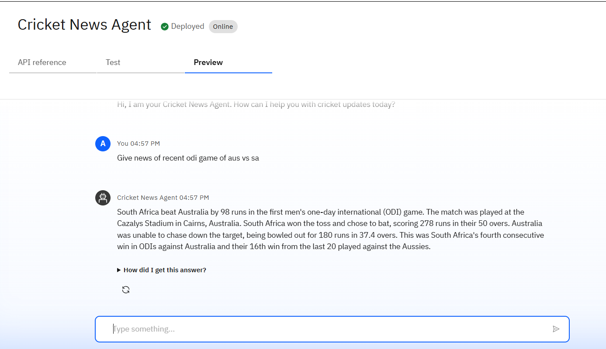

# 🏏 AI Cricket News Agent

The **AI Cricket News Agent** is an intelligent assistant built using **IBM Watsonx.ai** that delivers the latest cricket news, match updates, player statistics, and analysis.  
It helps cricket fans stay updated by summarizing articles, generating insights, and providing personalized news feeds.  

---

## ✨ Features
- 📰 Latest cricket news summaries  
- 📊 Player and team statistics  
- 🏆 Match results and schedules  
- 🔎 Personalized cricket news based on favorite teams/players  
- 🌍 Multi-language news summaries  
- 🎙 Optional voice-enabled news assistant  

---

## 🏗 Technology Stack
- **IBM Watsonx.ai Studio**  
- **IBM Cloud Runtime Deployment**  
- **Granite NLP Models**  
- Retrieval-Augmented Generation (RAG) for cricket databases and news feeds  
- Python / Curl API Integration  

---

## 🚀 Deployment
The AI agent is deployed on **IBM Watsonx.ai** as an online endpoint.  

- **Endpoint**: `https://eu-gb.ml.cloud.ibm.com/ml/v4/deployments/51ebff11-38fd-431f-8e84-f9aea2034644/ai_service?version=2021-05-01`  
- **Authentication**: Requires IBM Cloud API Key & IAM Token  

---

## 📌 Example Usage

### Python Example
```python
import requests

url = ('https://iam.cloud.ibm.com/identity/token', data={"apikey": API_KEY, "grant_type": 'urn:ibm:params:oauth:grant-type:apikey'})
mltoken = token_response.json()headers = {
    "Authorization": "Bearer <your-ibm-iam-token>",
    "Content-Type": "application/json"
}

data = {
    "input_data": [
        {"fields": ["query"], "values": ["Latest news about Virat Kohli"]}
    ]
}

response = requests.post(url, json=data, headers=headers)
print(response.json())
```

### Curl Example
```bash
curl -X POST "https://eu-gb.ml.cloud.ibm.com/ml/v4/deployments/51ebff11-38fd-431f-8e84-f9aea2034644/ai_service_stream?version=2021-05-01" \
--header "Authorization: Bearer <your-ibm-iam-token>" \
--header "Content-Type: application/json" \
--data '{"input_data":[{"fields":["query"],"values":["Upcoming ICC tournaments"]}]}'
```

---

## 🖼 Deployment Screenshot


---

## 🏏 Example Output
**Input:** "Latest news about India vs Australia series"  
**Output:**  
- Headline: *India beats Australia in thrilling 3rd ODI*  
- Summary: *India secured a 2-1 series victory after defeating Australia in the final match. Key performances came from Rohit Sharma and Mohammed Siraj.*  
- Next Match: *Test series begins on <date>*  

---

## 📌 Future Scope
- Live commentary integration  
- Fantasy cricket suggestions  
- Social media cricket trend analysis  
- Real-time score updates with push notifications  

---

## 👨‍💻 Author
Developed by **Anirban Kundu** using IBM Watsonx.ai Studio.  
